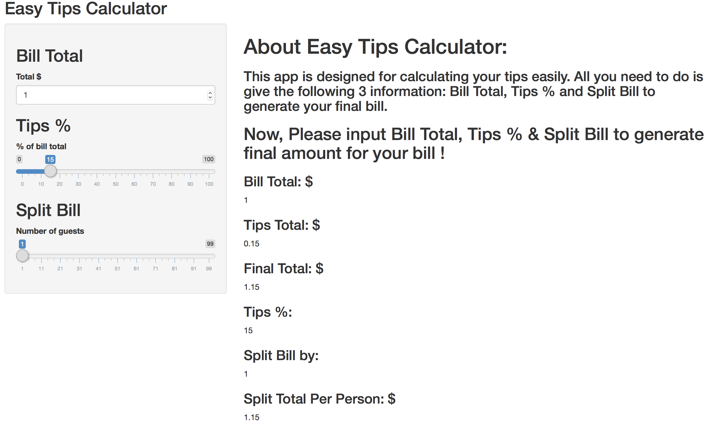

```{r setup, include=FALSE}
knitr::opts_chunk$set(echo = FALSE)
```

## <span style="color:darkgreen">Overview</span>

This was built as part of a deliverable for the course Developing Data Products as part of the Coursera Data Science Specialization. This course project is to write a Shiny Application. Here is more information about my App - <span style="color:red">*Easy Tips Calculator*</span>:  

**The application can be found in the following link:** 

-  [Easy Tips Calculator](https://wlh-nicole.shinyapps.io/MyApp/)
   
**The source code for ui.R and server.R files are on the GitHub:** 

- [ui.R](https://github.com/WLH-Nicole/Coursera_DataScience_9_DevelopingDataProducts/blob/master/MyApp/ui.R)

- [server.R](https://github.com/WLH-Nicole/Coursera_DataScience_9_DevelopingDataProducts/blob/master/MyApp/server.R)


## <span style="color:darkgreen">How Easy Tips Calculator work</span>

<span style="color:darkblue">**All you need to do is give the following 3 information: **</span>

- <span style="color:red">**Bill Total**</span>: the total amount $ shows on your bill

- <span style="color:red">**Tips %**</span>: percentage of bill total you want to tip them

- <span style="color:red">**Split Bill**</span>: split the bill between any number of people

##
<span style="color:darkblue">The following R code shows how to calculate your tips for your $100 bill with 20 % tips and split by 4 persons.</span>

```{r, echo=TRUE, eval=FALSE}
Bill.Total   <- 100      # $ shows on your bill
Tips.Percent <- 0.20     # 20 % tips
Split.Bill   <- 4        # split bill by 4 persons

Tips.Total  <- Bill.Total*Tips.Percent
Final.Total <- Bill.Total + Tips.Total
Split.Total <- round(Final.Total/Split.Bill, 2)

OutPut <- data.frame(Title=c("Bill Total$", 
                             "Tips Total: $",
                             "Final Total: $", 
                             "Tips %:", 
                             "Split Bill by:", 
                             "Split Total Per Person: $"), 
                    Values=c(Bill.Total, Tips.Total, Final.Total, 
                             Tips.Percent, Split.Bill, Split.Total)) 
```


## <span style="color:darkgreen">Easy Tips Calculator</span>
- <span style="color:darkblue">**Example: Bill Total: $100, 20% Tips, Split Bill by 4 persons.**</span>

```{r  out.width = "90%"}

```

